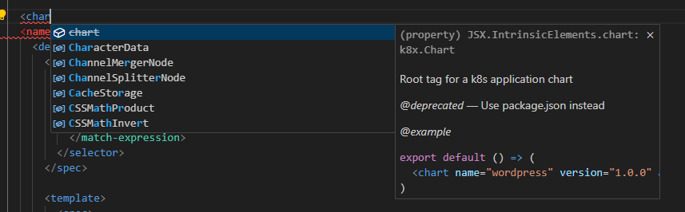

# Kubernetix (K8x)
Deploy and manage reusable apps with typescript and jsx

## Example chart

```tsx
import Wordpress from "@charts/wordpress"

const replicas = Number(process.env["VARIABLE"]);

export default () => (
  <cluster config="~/.kube/config">
    <namespace name="default">

      <Wordpress containerName="wordpress"></Wordpress>

      <deployment>
        <spec replicas={replicas}>
          <selector>
            <match-label key="app">wordpress</match-label>
          </selector>
        </spec>

        <template>
          <spec>
            <container
              image="registry.k8s.io/serve_hostname"
              imagePullPolicy="Always"
              name="wordpress"
            ></container>
          </spec>
        </template>
      </deployment>

    </namespace>
  </cluster>
);
```

## Features:

- .env integration
  - K8X_MY_VARIABLE
- Automatic namespace handling
  - Auto create namespaces
- Sharing
  - `npm install -D @charts/wordpress`
  - `import Wordpress from "@charts/wordpress"`
- Packaging/Versioning
  - `npm version patch -m "Upgrade to 1.0.1 for reasons"`
  - `npm pack @charts/wordpress`
  - `npm publish wordpress.tgz`
- JSX templating
- Type checking
- Single binary
- Safe sandboxing
- Tests
- IDE support
  
- Single installation definition
  - Specify `chart.id` on `package.json` and run `k8x install` without name parameter
- Reusable components
  - Props
- Hooks
  - `<Wordpress beforeInstall={slackMessage} afterInstall={slackMessage} onError={handleError} />`
  - `beforeInstall` `afterInstall` `onInstallError` `beforeUpdate` `afterUpdate` `onUpdateError` 

## Usage

```
k8x install <name>
k8x install my-wordpress
k8x update my-wordpress
k8x compile
k8x ls
k8x rm
```

## Goals
Reuse existing infrastructure and code features for enhanced developer experience

## Non Goals
<Todo/>

## Helm differentiation

In general k8x is pretty similar to helm. It also took a lot of inspiration from it. But where helm is reinventing the wheel, k8x just falls back to already used mechanisms and infrastructure. (npm/typescript/configuration)

| Topic | helm | k8x |
| -------- | ------- | ------- | 
| Packaging | custom | npm |
| Templating | gotmpl | tsx |
| Configuration | yaml | .env |
| Scripting | custom | tsx |
| Code sharing | custom | tsx |

By custom I mean either a custom implementation, or a existing template language with limited or changed features.

## Acknowledgements

My experience with real world k8s apps is limited. I work professionally as a developer, so my perspective is biased. I draw a lot of impressions from coding and managing simple applications with docker and docker compose. I am using helm and k8s at work and some of my frustrations might come from inexperience or seem perfectly fine for experienced k8s admins or ops people.

## Terminology

### Component

A piece of tsx code, that is typically a kubernetes entity, for example ingress, pod, service

### Tag

A tsx directive for example <cluster> or <namespace>

## FAQ

### Why JSX/TSX

JSX and TSX already are very mature tooling built directly into the tsc toolchain. IDE support is superior compared to simple yaml or other templating engines. Node has a very mature package and easy accessible code/chart sharing mechanism.
